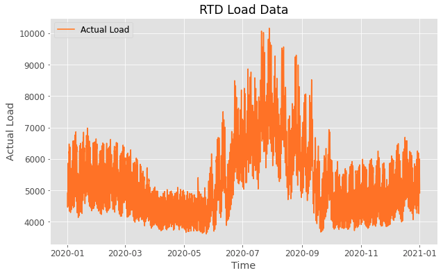

# Weather Normolization

- Data processing and data analysis
- Prediction Model 1. Linear Regression 2. lightGBM Regressor
- Conclusion 2020 vs 2021

# Data processing and data analysis
First, we download the Histoircal load data from NYISO between 2020/01/01 to 2020/12/31 in N.Y.C and Historical weather in NOAA with same time period. Since NYISO data reports 5-min interval and NOAA data is hour interval, we combine it to the same hourly time and finally gets 11579 rows.

We can see in this figure, actual load is highest in the summer and least in the spring and fall. This result is not difficult to imagine, because the summer heat requires more electricity to dissipate heat.

# Prediction Model
The linear regression gets around 0.3 R squared accuracy. It is low and we can say it is because there are not linear between features and label. Next, we uses lightGBM Regressor and after parameter tuning, we get around 0.74 R squared accuracy.

# Conclusion 2020 vs 2021
